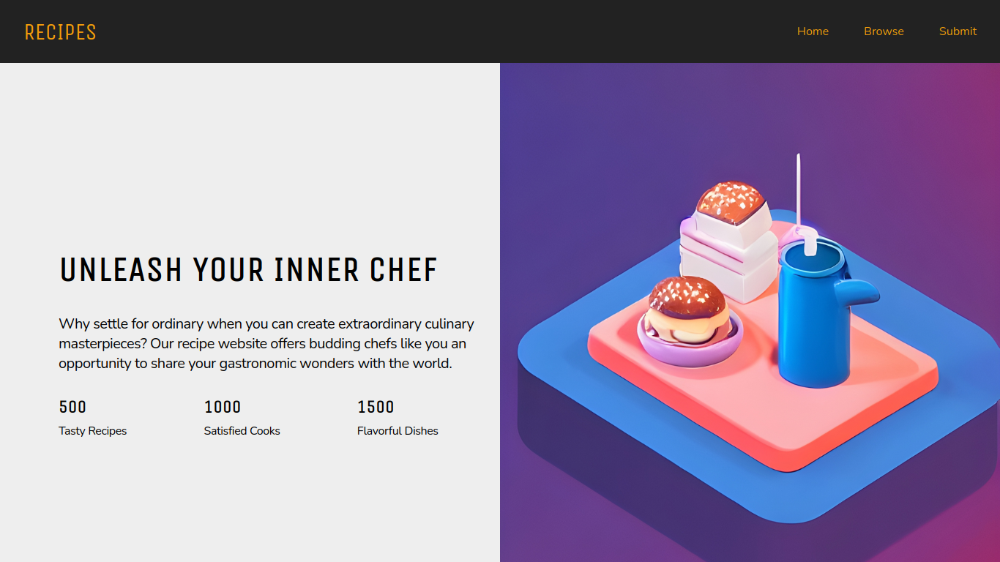

# Recipe Revolution

A responsive landing page for the Fiction Recipe Revolution website, where users can submit their own favorite recipes.

The webpage is created using semantic HTML and CSS, ensuring a clean and accessible design.

 

 

## Features

- **Responsive Design**: The landing page is designed to be mobile-friendly and responsive, adapting to various screen sizes including mobile, tablet, desktop, and 2K screens.

- **Recipe Submission**: Users can easily submit their favorite recipes through a user-friendly form integrated into the landing page.

 

## Contributing

Contributions are welcome! If you'd like to contribute to the Fiction Recipe Revolution landing page, please follow these steps:

- Fork the repository.

- Create a new branch: **git checkout -b feature/your-feature-name**

- Make your changes and commit them: **git commit -m "Add your commit message"**

- Push the changes to your forked repository: **git push origin feature/your-feature-name**

- Open a pull request on the original repository, describing your changes and their purpose.
